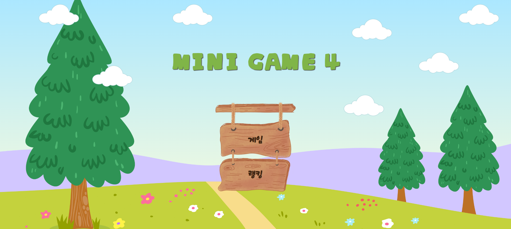
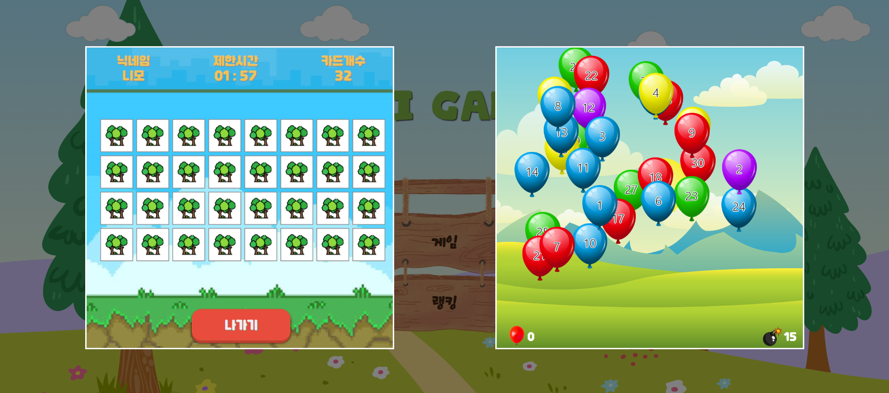
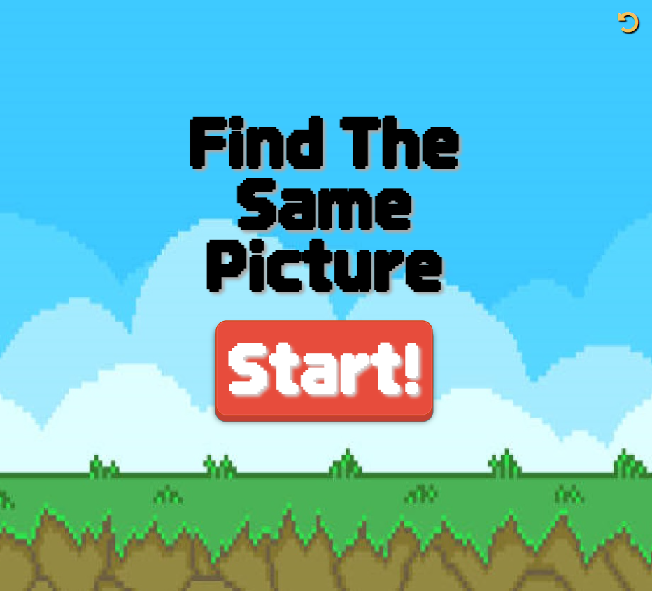
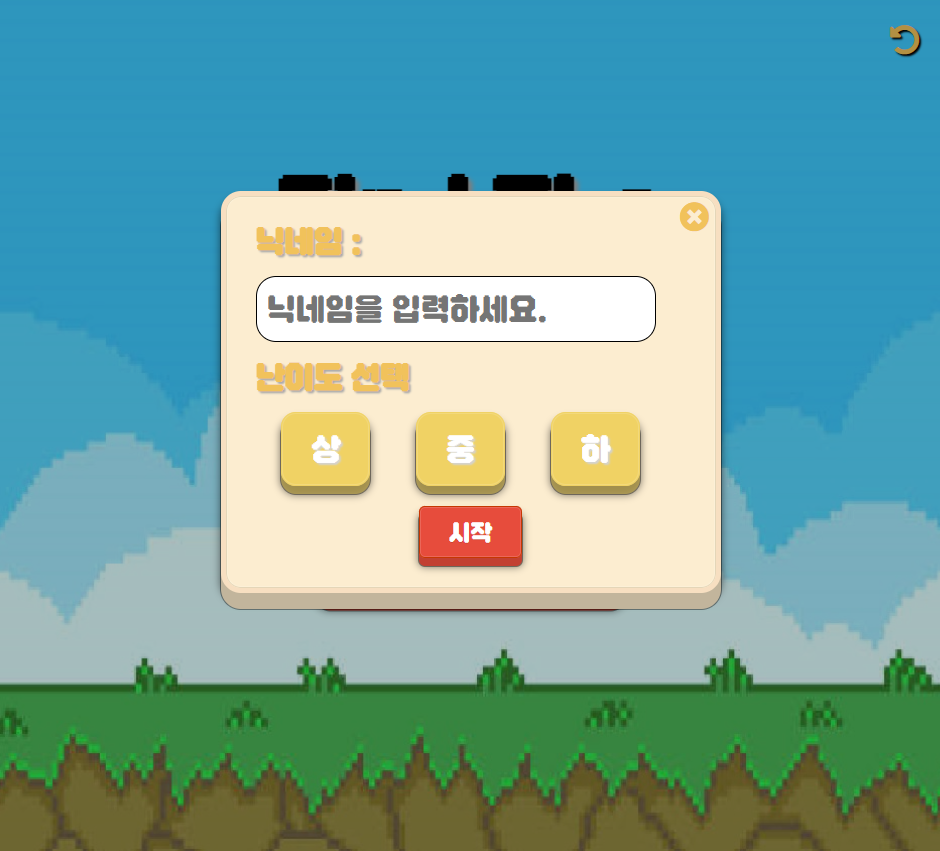
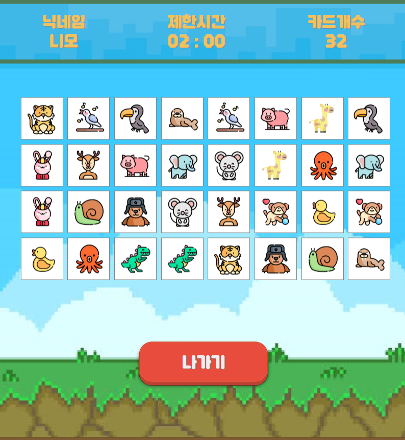
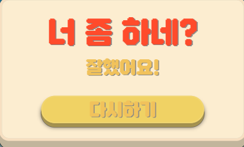
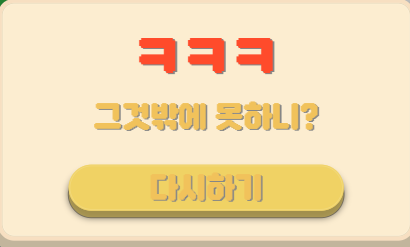
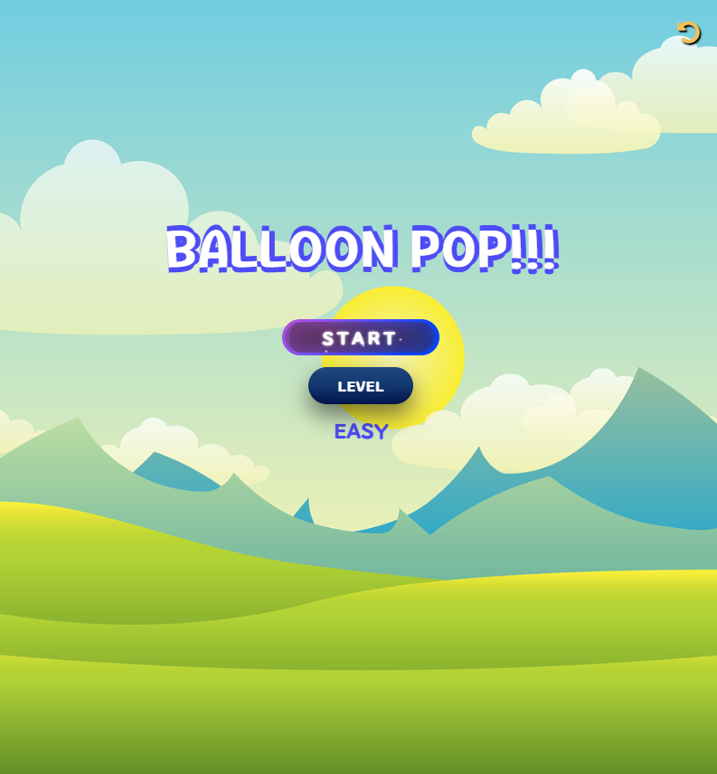
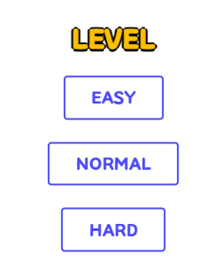
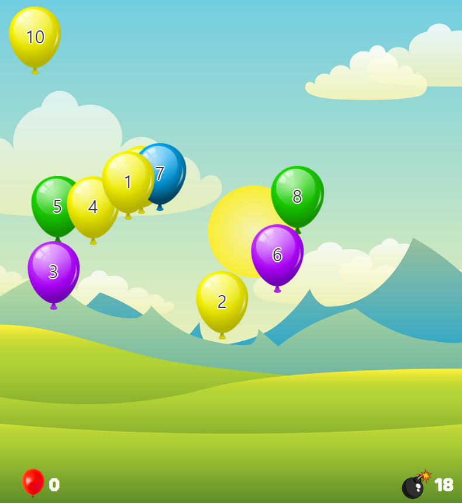

## 목차
- 프로젝트 소개
- 팀원 소개
- 주요 기능 및 로직 소개
- 개발 일정
- 예시화면
- 업데이트 예정

## 프로젝트 소개
- '랜덤값(Math.random())'을 활용하여 만들 수 있는 간단한 게임 2가지를 만들었습니다.
- 게임은 '같은 그림 찾기'와 '풍선 터트리기'가 있습니다.
- 짧은 시간 내에 클리어를 하도록 유도함으로써 순발력을 기를 수 있습니다.
- 현대인들의 바쁜 삶과 YouTube Shorts를 보는 시청습관으로 가볍고 짧은 컨텐츠를 추구하는 니즈에 맞춰 언제어디서나 간단히 즐길 수 있는 게임을 만들기로 하였습니다.

## 팀원 소개
|팀원|담당|깃허브|
|:---:|---|---|
|박진우|Front|https://github.com/JinWooP98|
|김예진|Front|https://github.com/zinit95|
|배윤정|Front|https://github.com/yunjeongg|
|송지훈|Front|https://github.com/songjihoon12|

## 기술스택
HTML, CSS, JAVASCRIPT, VISUALSTUDIO, GITHUB

## 주요 기능 및 로직 소개
1. 메인페이지
  - 게임버튼을 통해 하고 싶은 게임 선택이 가능합니다.

2. Find The Same Picture(같은그림찾기)
  - 시작페이지
    - 되돌아가기 아이콘을 클릭하면 메인페이지로 돌아갈 수 있습니다.
    - Start버튼을 통해 나타난 게임 설정창에서 게임을 즐기는 동안 사용할 닉네임을 입력하고 난이도('상', '중', '하')를 선택할 수 있습니다.
    - 게임 설정창의 x 버튼을 클릭하면 게임 설정창이 사라집니다.

  - 게임페이지
    - 게임 설정창에서 작성한 닉네임이 게임페이지 상단 닉네임에 표시됩니다.
    - 설정한 난이도에 따른 카드 개수가 달라집니다.('상 = 32개', '중 = 24개', '하 = 16개')
    - 게임을 시작할때마다 카드의 위치가 달라집니다.
    - 게임을 시작하면 카드 전체를 일정시간 뒤집어 보여줍니다.
    - 게임 시작 시 2분의 타이머가 주어집니다.
    - 매 턴마다 카드 2장을 뒤집을 수 있으며, 2장의 카드 이미지가 일치할 경우 카드가 뒤집힌 상태로 고정되며, 이미지가 다를 경우 다시 뒤집어집니다.
    - 타이머 내 모든 카드를 뒤집을 경우 '성공'화면이 나타납니다.
    - 타이머가 종료될 경우 '실패' 화면이 나타납니다.
    - 타이머는 매 게임마다 초기화됩니다.
    - 타이머의 시간이 10초 이하로 남을 경우 시간이 흔들립니다.
    - 게임창 하단의 '나가기'버튼을 클릭하면 게임을 중지할 수 있습니다.
    - '성공', '실패'화면의 '다시하기'버튼을 누르면 게임 설정창으로 되돌아갑니다.

3. Balloon_game(풍선 게임)
  - 시작페이지
    - 'START' 버튼을 통해 게임페이지로 들어갈 수 있습니다.
    - 'LEVEL CHOICE' 버튼을 통해 난이도 ('EASY', 'NORMAL', 'HARD')를 선택할 수 있습니다.
    - 시작페이지의 '뒤로가기' 버튼을 통해 메인페이지로 나갈 수 있습니다.

  - 게임페이지
    - 'LEVEL CHOICE' 버튼을 통해 선택한 난이도에 따라 'EASY = 10개', 'NORMAL = 20개', 'HARD = 30개'로 풍선 개수가 조정됩니다.
    - 풍선의 위치는 랜덤으로 배치됩니다.
    - 풍선의 색상은 랜덤으로 정해집니다.
    - 게임시작 후 타이머(20초)의 시간이 주어집니다.
    - 풍선은 낮은 숫자부로 차례로 클릭하여 터트릴 수 있습니다.
    - 풍선을 터트릴 때 마다 터트린 개수가 게임페이지에 표시됩니다.
    - 시간 내 모든 풍선을 터트릴 경우 '성공'창이 표시됩니다.
    - 시간 내 모든 풍선을 터트리지 못할 경우 '실패'창이 표시됩니다.
    - '성공', '실패' 창의 'RETRY' 버튼을 통해 시작페이지로 돌아갈 수 있습니다.

## 개발 기간
- 2024.04.04 ~ 2024.04.15
  - 주제 선정 및 역할 분배
  - HTML/CSS 구조잡기 및 꾸미기
  - JAVASCRIPT 기능설계 및 구현
  - 코드합치기 및 수정, 피드백
  - 최종검토
  - PPT제작 및 발표준비

## 예시화면
- 메인페이지
  - 
- 메인페이지-게임선택
  - 
- 같은그림찾기-시작페이지
  - 
- 같은그림찾기-게임설정창
  - 
- 같은그림찾기-게임페이지
  - 
- 같은그림찾기-게임클리어
  - 
- 같은그림찾기-게임실패
  - 
- 풍선게임-시작페이지
  - 
- 풍선게임-난이도선택
  - 
- 풍선게임-게임페이지
  - 
- 풍선게임-게임클리어
  - 
- 풍선게임-게임실패
  - 

## 업데이트 예정
- 로그인 SNS 연동
  - 게임 시작 전 로그인 시스템을 적용하고 SNS 연동 서비스 구현
- 스코어 기록
  - 로그인 시스템을 바탕으로 개인 최고기록을 저장해주는 시스템 구현
- 랭킹 시스템
  - 플레이어들의 최고기록을 비교하여 랭킹을 적용하여 경쟁을 유발하고 순위 변동에 따라 SNS 알림 발송 시스템 적용
- 이미지 커스텀
  - 기본이미지가 아닌 원하는 이미지로 게임을 즐길 수 있는 시스템 적용
- 하트 시스템
  - 기본적으로 즐길 수 있는 판수를 제한하고 일정시간이 지나거나 친구에게 하트를 받아야 즐길 수 있는 시스템 구현
- 포인트 상점
  - 게임 클리어시 마다 포인트를 지급하여 상점에서 게임아이템을 구매하거나 게임스타일을 변경하는 시스템 구현